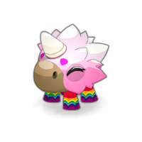

# dofamilier
<p align="center">
    <a href="https://dofamilier.netlify.app/" target="_blank">
        
    </a>
</p>
## 📖 About dofamilier <br />
Dofamilier is a web application made to help Dofus players to calculate their pets level and give them more informations about it.

### 🔧 Project setup
```
npm install
```

### 🔥 Compiles and hot-reloads for development
```
npm run serve
```

### 🌐 Compiles and minifies for production
```
npm run build
```

### 📝 Todo
* [ ] Allow users to calculate their pets levels from a specific level to another.
* [ ] Add table of xp per level.
* [ ] Add all Dofus ressources with xp.
